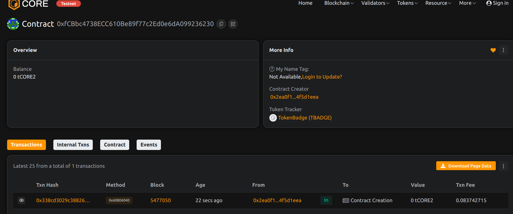

# TokenBadge – NFT-Based Contributor Recognition System

## 📄 Project Description

TokenBadge is an NFT-based recognition platform designed to reward contributors, volunteers, and participants with unique badges. Each badge is a non-transferable NFT that serves as proof of contribution and achievement.

## 🎯 Project Vision

To empower DAOs, communities, and organizations with a decentralized credentialing system that honors contribution in a secure, verifiable, and immutable manner using NFTs.

## ✨ Key Features

- 🏷️ Mint NFTs as contributor badges
- ⛔ One badge per contributor policy
- 🔁 Revocable badges for flexible governance
- 🎨 Metadata support for badge customization
- 🛡️ Admin-controlled badge issuance

## 🔮 Future Scope

- Integration with soulbound token standards (non-transferable NFTs)
- On-chain verification for DAO voting or access rights
- Batch issuance for event-based participation
- DAO governance for awarding and revoking rights

## 📜 Contract Details
0xfCBbc4738ECC610Be89f77c2Ed0e6dA099236230
